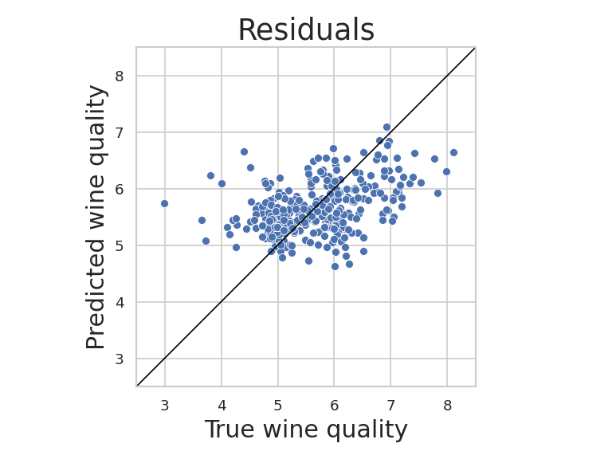

 ## Model Performance
Training variance explained: 33.0%
Test variance explained: 32.0%
 ## Visulization

 ## Model Performance
Training variance explained: 33.0%
Test variance explained: 32.0%
 ## Visulization

 ## Model Performance
Training variance explained: 33.0%
Test variance explained: 32.0%
 ## Visulization

